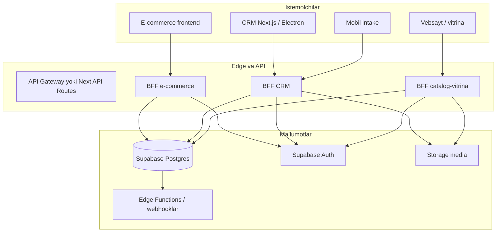
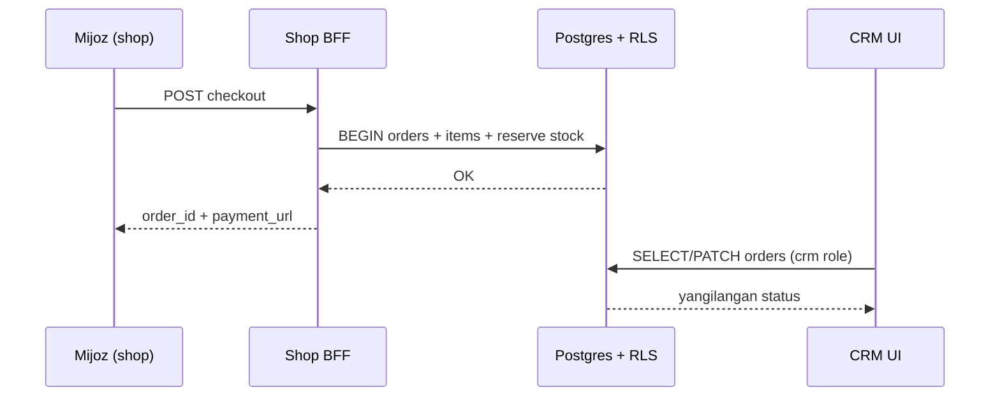

# Nuur Home — platforma arxitekturasi

Bu hujjat **e-commerce**, **CRM** va **catalog-vitrina** (mahsulot vitrinasi) uchun yagona backend va maʼlumotlar modeli qanday tuzilishi kerakligini tasvirlaydi. Hozirgi repozitoriyada asosan **Next.js 14** (CRM UI, port `4000`) va **Supabase (PostgreSQL + Auth + RLS)** ishlatiladi; yangi backend qatlamlari shu asosga mos ravishda rejalashtiriladi.

---

## 1. Maqsad va chegaralar (bounded contexts)

| Kontekst | Vazifa | Asosiy isteʼmolchilar |
|----------|--------|------------------------|
| **E-commerce** | Onlayn buyurtma, toʻlov/summa, savat, yetkazib berish holati, mijoz self-service | Mijoz (veb/mobil ilova) |
| **CRM** | Buyurtmalar boshqaruvi, mijozlar, xodimlar, ombor/moliya integratsiyasi, ichki jarayonlar | Admin, sotuvchi, ombor, `mobile_intake` va boshqalar |
| **Catalog-vitrina** | Mahsulotlar, kategoriyalar, media, SEO-friendly ommaviy katalog (oʻqish uchun optimallashtirilgan) | Sayt tashrifchisi, marketing kanallari |

**Prinsip:** bitta **PostgreSQL** sxemasi ichida jadvallar boʻlishi mumkin, lekin **API va RLS siyosatlari** kontekst boʻyicha ajratiladi — e-commerce va vitrina faqat ruxsat etilgan ommaviy/klient maʼlumotlarini koʻradi; CRM ichki maydonlarga kengroq kiradi.

---

## 2. Yuqori darajadagi arxitektura



**Tavsiya:** prod uchun aniq **BFF** (Backend-for-Frontend) qatlamlari: har bir domen uchun alohida route prefix yoki alohida xizmat (`/api/shop/*`, `/api/crm/*`, `/api/catalog/*`), ichkarida bir xil DB lekin turli **servis modullari** va **RLS**.

---

## 3. Texnologik stack (joriy va kengaytirish)

| Qatlam | Tanlov | Izoh |
|--------|--------|------|
| Maʼlumotlar | **PostgreSQL** (Supabase) | RLS, triggerlar, indekslar |
| Auth | **Supabase Auth** | JWT, `auth.uid()`, rollar `profiles` da |
| Fayllar | **Supabase Storage** | Katalog va CRM media |
| Server | **Next.js Route Handlers** yoki alohida **Node** API | Yangi kod `src/server` yoki `app/api/...` da modullashtiriladi |
| Real-time (ixtiyoriy) | Supabase Realtime | buyurtma holati, ichki bildirishnomalar |
| Integratsiyalar | Edge Functions / server webhooklar | toʻlov, Telegram, ERP inbound |

---

## 4. Domen modellari (mantiqiy entitylar)

### 4.1 Umumiy (shared kernel)

- **profiles** — foydalanuvchi, `role` (masalan: `admin`, `crm`, `mobile_intake`, `customer`).
- **organizations / branches** — agar filiallar kerak boʻlsa (keyingi bosqich).
- **audit_log** — muhim o‘zgarishlar (narx, zaxira, buyurtma holati).

### 4.2 Catalog-vitrina

- **categories**, **products**, **product_variants** (rang/o‘lcham/SKU).
- **product_media**, **product_attributes**.
- **publication_state**: `draft | published | archived` — vitrina faqat `published`.
- **seo**: slug, title, description (alohida jadval yoki ustunlar).

### 4.3 E-commerce

- **carts**, **cart_items** (sessiya yoki `user_id`).
- **orders**, **order_items**, **order_status_history**.
- **payments** (holat, provayder ID), **shipping_addresses**.
- **customers** — profil bilan bog‘langan yoki mehmon sessiyasi.

### 4.4 CRM

- **orders** bilan bir xil jadval — CRM tomoni status va ichki maydonlarni boshqaradi.
- **erp_inbound_requests** (loyihada allaqachon RLS namunalari bor) — tashqi/tashqi qabul.
- **inventory_movements**, **employees**, ichki moliya/ombor modullari (mavjud CRM sahifalariga mos).

---

## 5. Xavfsizlik: RLS va rollar

- Har bir jadval uchun **minimal** `SELECT/INSERT/UPDATE` siyosatlari.
- **Vitrina anonim**: faqat `published` mahsulotlar, narxlarni ko‘rsatish siyosati aniq yoziladi (masalan, opt-in “ommaviy narx”).
- **Mijoz**: faqat o‘z `orders`, o‘z `profiles`, o‘z savati.
- **CRM rollari**: `crm`, `admin` — buyurtmalar va ichki jadvallar.
- **mobile_intake**: alohida cheklovli kirish (loyihadagi `has_mobile_intake_access` va `has_crm_or_mobile_inbound_access` kabi funksiyalar namuna sifatida).

**Servis rolli (ixtiyoriy):** og‘ir biznes qoidalari uchun `SECURITY DEFINER` RPC (masalan: buyurtmani yopish, zaxirani kamaytirish) — barcha yozuvlar `audit_log` orqali.

---

## 6. API dizayni (REST konventsiyasi)

Barcha javoblar JSON; xatoliklar: `400`, `401`, `403`, `404`, `409`, `422`, `500` + bir xil `error.code`.

### 6.1 Catalog-vitrina (`/api/catalog/v1/...`)

| Metod | Yo‘l | Vazifa |
|--------|------|--------|
| GET | `/categories` | daraxt yoki tekis ro‘yxat |
| GET | `/products` | filtr: kategoriya, qidiruv, pagination |
| GET | `/products/:slug` | batafsil + variantlar + media |
| GET | `/products/:id/related` | tavsiyalar (ixtiyoriy) |

**Caching:** `Cache-Control`, CDN; og‘ir so‘rovlar uchun materialized view yoki `published` uchun indeks.

### 6.2 E-commerce (`/api/shop/v1/...`)

| Metod | Yo‘l | Vazifa |
|--------|------|--------|
| POST | `/cart/items` | savatga qo‘shish |
| PATCH | `/cart/items/:id` | miqdor |
| POST | `/checkout/sessions` | buyurtma yaratish + to‘lov sessiyasi (provayderga tayyor) |
| GET | `/orders` | mijozning buyurtmalari |
| GET | `/orders/:id` | tafsilot + tracking |

**Tranzaksiya:** buyurtma yaratish + zaxira ushlab qolish bitta RPC/tranzaksiya ichida.

### 6.3 CRM (`/api/crm/v1/...`)

| Metod | Yo‘l | Vazifa |
|--------|------|--------|
| GET/PATCH | `/orders`, `/orders/:id` | filtr, status, izohlar |
| POST | `/orders/:id/status` | status o‘tkazish + tarix |
| GET/POST | `/inbound` | ERP inbound (mavjud servislar bilan mos) |
| GET/PATCH | `/products` | draft/publish, ichki maydonlar |
| POST | `/inventory/adjust` | ombor tuzatish (rol bilan) |

Barcha CRM endpointlarida **server** tomonda `service_role` ishlatmasdan, imkon qadar **foydalanuvchi JWT + RLS** (yoki aniq tekshirilgan admin-only RPC).

---

## 7. Maʼlumotlar oqimi (buyurtma misoli)



---

## 8. Repozitoriya tuzilishi (0 dan qayta yozish uchun maqsadli)

Quyidagi tuzilish yangi backend kodini tartibga solish uchun asos boʻlishi mumkin (loyihaga qarab `src` ichida jamlash mumkin):

```text
src/
  server/
    catalog/       # vitrina so‘rovlari, DTO, validatsiya
    shop/          # savat, checkout, mijoz buyurtmalari
    crm/           # ichki operatsiyalar
    shared/        # pagination, errors, supabase server client
  app/
    api/
      catalog/[...]/route.js
      shop/[...]/route.js
      crm/[...]/route.js
  lib/
    supabase.js    # mavjud mijoz
  services/        # mavjud domain servislar — bosqichma-bosqich server/ ga ko‘chirish
supabase/
  migrations/      # sxema va RLS — bitta manba
```

**Muhim qoida:** biznes qoidalari imkon qadar **DB trigger/RPC** yoki **bitta server modulida** takrorlanmasligi uchun markazlashtiriladi.

---

## 9. Integratsiyalar va navbatlar

- **Toʻlov provayderi:** webhook → `payments` yangilash → `orders.status`.
- **Telegram / bildirishnomalar:** mavjud `app/api/telegram` va `utils/telegram.js` bilan bir xil pattern.
- **ERP / inbound:** `erp_inbound_requests`, `services/erp*` modullari bilan davom ettirish.

Keyinchalik **ish navbati** (Redis / PGMQ / Supabase queue) og‘ir hisobotlar yoki tashqi sinxronizatsiya uchun.

---

## 10. Kuzatuv va sifat

- **Structured logging** (request_id, user_id, kontekst).
- **Health** endpoint: DB + storage tekshiruvi.
- **Playwright** (allaqachon bor) — kritik CRM oqimlari; shop uchun alohida e2e to‘plami.

---

## 11. Loyihani ishga tushirish (joriy CRM)

```bash
npm install
npm run dev
```

Brauzerda: `http://localhost:4000`

**Muhit o‘zgaruvchilari:** `.env.example` dagi Supabase kalitlari; production uchun hech qachon `service_role` ni brauzerga bermaslik.

---

## 12. Keyingi qadamlar (amaliyot)

1. `supabase/migrations` ichida **catalog / shop / crm** jadvallari va RLS ni bitta ketma-ketlikda yozish.
2. `app/api` ostida **uchta prefix** bilan route handlerlar va umumiy xatolik formati.
3. Vitrinani **faqat o‘qish** API bilan ajratish; e-commerce yozuvlarini **faqat autentifikatsiya** yoki cheklangan anonim savat bilan.
4. Mavjud CRM ekranlarini bosqichma-bosqich yangi `crm` API ga ulash (Supabase to‘g‘ridan-to‘g‘ri chaqiriqlarni kamaytirish).

---

*Hujjat versiyasi: 2026-04 — e-commerce, CRM va catalog-vitrina uchun yagona arxitektura rejası.*
